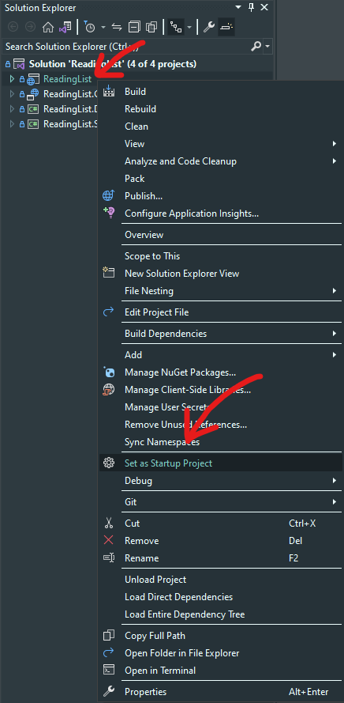
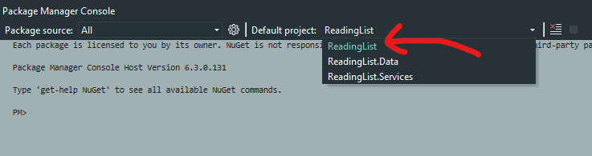
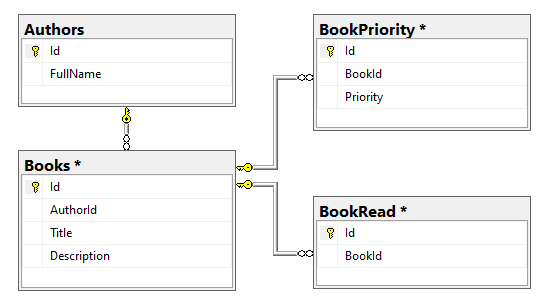

# ReadingList
This project allows user to add books and authors to database and create own Reading List.

### Features
- CRUD operations on books and authors
- Search bar for filtering books
- Marking books as read
- Creating "Reading List" where you can add and change the order of books just by dragging them

# Configuration
## 1. Startup project
Right click on the `ReadingList` project in Solution Explorer and select `Set as Startup Project`
    

## 2. Database
1. Connection String
    - Change your connection string in [appsettings.json](ReadingList/appsettings.json)
```json
"ConnectionStrings": {
    "Default": "Server=(localdb)\\mssqllocaldb;Database=ReadingList;Trusted_Connection=True;"
}
```

2. Initiate database
    - Choose `ReadingList` as Default project in Package Manager Console.
        
    - Run `update-database` command.
> Sample data would be inserted into database automatically by using the [AuthorAndBookSeeder](ReadingList.Services/AuthorAndBookSeeder.cs)

### You can start the API now

## 3. React Client
The way I open client project is to open `ReadingList.Client` in Visual Studio Code.
- From there run those two commands in terminal.
    - `npm install`
    - `npm start`
>**Note**
> There might be an error saying [Plugin "react" was conflicted between "package.json » eslint-config-react-app »](https://stackoverflow.com/questions/70377211/error-when-deploying-react-app-and-it-keeps-sayings-plugin-react-was-confli)

# Architecture
- Solution contains four layers
    ([Api](ReadingList),
    [Data](ReadingList.Data),
    [Services](ReadingList.Services),
    [Client](ReadingList.Client))
- I used Unit of Work pattern to inject all repositories into a single [class](ReadingList.Data/UnitsOfWork/ReadingListUnitOfWork.cs)
- [Controllers](ReadingList/Controllers) are used for handling requests from the client.
- [Services](ReadingList.Services) handle all necessary logic like mapping DTO models using AutoMapper and calling repositories.
- [Repositories](ReadingList.Data/Repositories) handle database operations, each repository corresponds to its own table from database.

# Database

